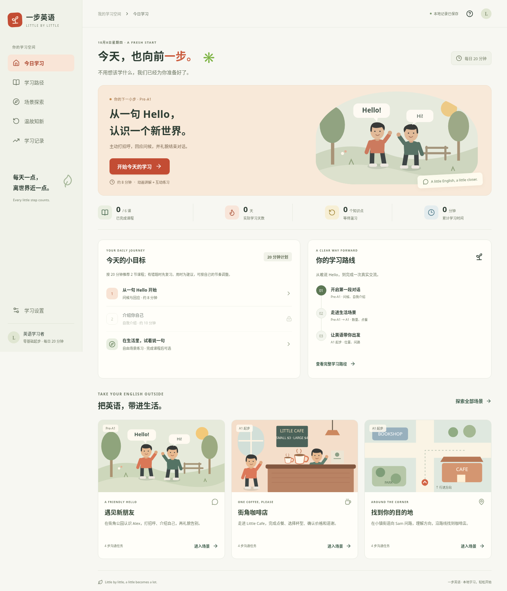

# 一步英语 · Little by Little

面向中文母语学习者的免费、免注册英语学习 MVP。每天打开网站即可知道下一步：先复习需要巩固的知识，再学习推荐课程，并在原创动画场景中完成真实的沟通任务。



## 运行

需要 Node.js 24+（本项目验证版本 24.19.0）。

```bash
npm ci
npm run dev
```

在终端提示的地址访问网站。首次选择基础与每日 10/20/30 分钟时长，再点击「开始今天的学习」。完成课程的练习及情境任务后，首页和完成页都会推荐下一课。浏览器刷新后恢复已完成进度；未提交的单节课状态会重新开始。

```bash
npm test                # 学习规则、回答判定和内容一致性
npm run build           # 严格 TypeScript 检查和生产构建
npm run test:e2e        # 启动真实浏览器执行完整用户流程
npm run test:production # 构建 dist 后用真实浏览器验证生产版本
npm run format:check
npm run preview         # 预览 dist 生产构建
```

云环境 npm 缓存需放在可写目录，可使用 `npm ci --cache /tmp/english-npm-cache`。浏览器测试优先使用 `/usr/bin/chromium`，可通过 `CHROMIUM_PATH` 指定本机浏览器；没有系统 Chromium 时，运行 `npx playwright install chromium`，Playwright 会使用下载的浏览器。Linux 缺少系统库时，按照 Playwright 官方安装指南安装依赖。CI 已配置完整安装。

静态发布 `dist/` 到站点根路径即可，无需后端、账号、模型或 API Key。语音识别需要 HTTPS（本机开发地址例外）以及浏览器支持和用户麦克风权限。

在线交付采用 Vercel，仓库提供 `vercel.json`，无需公开源码或先合并 PR。发布步骤、凭据边界及在线验收见 [部署说明](docs/DEPLOYMENT.md)。当前状态以 [HANDOFF.md](HANDOFF.md) 为准；尚未部署时不把构建产物或测试截图当作在线网址。

## 已有功能

- 新手水平与学习时长选择；连续学习路径、每日推荐和自动衔接。
- 六课：问候 → 自我介绍 → 数量与复数 → 礼貌点餐 → 位置 → 问路。前期任务只用已教表达，不越过先修内容。
- 每课包含中文讲解、可暂停/重播/分步操作的 SVG 动画、例句、听力理解、选择与文字表达、情境应用及结果反馈；后半程默认收起中译。
- 三个完整自由场景：问候与自我介绍、咖啡店点餐、问路。每个场景有四步对话示范、口袋表达、场景词语交互、回答分支和完成反馈。
- 语音：优先系统英文 TTS；设备缺少英文声音时播放随站提供的 48 段备用合成音频。支持重复、慢速、停止，以及可编辑的语音识别结果和文字回退。
- 真实练习结果、本地进度、知识状态、间隔复习、学习页停留时长、数据导出/导入及存储异常提示。
- 响应式桌面、平板、手机布局，键盘操作、语义表单、状态播报、跳到主内容和减少动画偏好。

课程只有练习全部改正并完成应用任务后才算完成。首次错误不会被改正后的答案覆盖：需复习的知识立即安排巩固；一次正确的课程次日复习。复习正确逐步延长到 1/3/7/14 天，答错 10 分钟后再练。自由场景不解锁课程，但已学相关知识的场景错误会触发复习。

## 目录与维护入口

```text
src/
  content.ts                 # 课程、场景、先修顺序和句型判定
  learning.ts                # 记录校验、每日计划、复习和进度规则
  App.tsx                    # 状态、持久化与导航外壳
  pages/                     # 首页、引导、路径、探索、复习、记录、设置
  components/                # 课程、练习、对话、原创 SVG 场景和语音
  ai.ts                      # 未来安全服务端 AI 接入契约
  audio-manifest.json        # 教学句子与备用音频的映射
  learning.test.ts           # 规则与课程测试
public/audio/                # 网站自带音频，无运行时付费 API
scripts/generate-audio.ts    # 可选的开发期音频生成工具
tests/learning.e2e.ts       # 浏览器验收
docs/                      # 课程扩展、调研、测试结果
output/playwright/         # 已实际生成的验收截图
```

新对话先读 [AGENTS.md](AGENTS.md)、[REQUIREMENTS.md](REQUIREMENTS.md)、[RULES.md](RULES.md)、[HANDOFF.md](HANDOFF.md)。新增课程与场景见 [扩展说明](docs/EXTENDING.md)。工具、Skills 调研与依赖许可证见 [调研记录](docs/RESEARCH.md)。验收证据见 [测试报告](docs/TESTING.md)。

## 当前限制

- 六课是 Pre-A1 到 A1 的入门片段，不是完整 A1/A2 课程或能力认证。采用基础选择而非正式测评；不自动跳过未验证先修课。
- 本地记录不自动跨设备同步；浏览器清理/无痕模式可能丢失记录。建议定期导出。当前只恢复已提交的课程与场景结果，不恢复未完成课中的步骤。
- 文字回答按公开的预设句型判定，不能替代开放式作文或自由对话评估。AI 仅预留接口，没有未实现的配置按钮，也不收集密钥。
- 备用语音为 eSpeak NG 合成，音色较机械；系统有英文语音时优先使用系统声音。真实麦克风与浏览器厂商识别服务需要在使用者设备上验证，不把识别文本当作发音分数。
- 学习时长是可见学习页面的停留时间，不等于注意力或口语练习时长；后台暂停，每 15 秒保存，直接关闭时最后不足 15 秒可能未保存。
- 浏览器自动化目前验证 Chromium，尚未验证 Safari/Firefox 或真实触屏设备。官方 CEFR 和 British Council 站点在当前网络中返回代理 403；已用可访问的 CEFR-J 数据交叉检查基础词汇与语法，完整官方描述仍待复核。

后续优先加入正式的小型起点测评、更多生产性表达、完整 A1/A2 课程、专业录音和跨浏览器验收；账号同步及安全 AI 服务端作为独立阶段。
